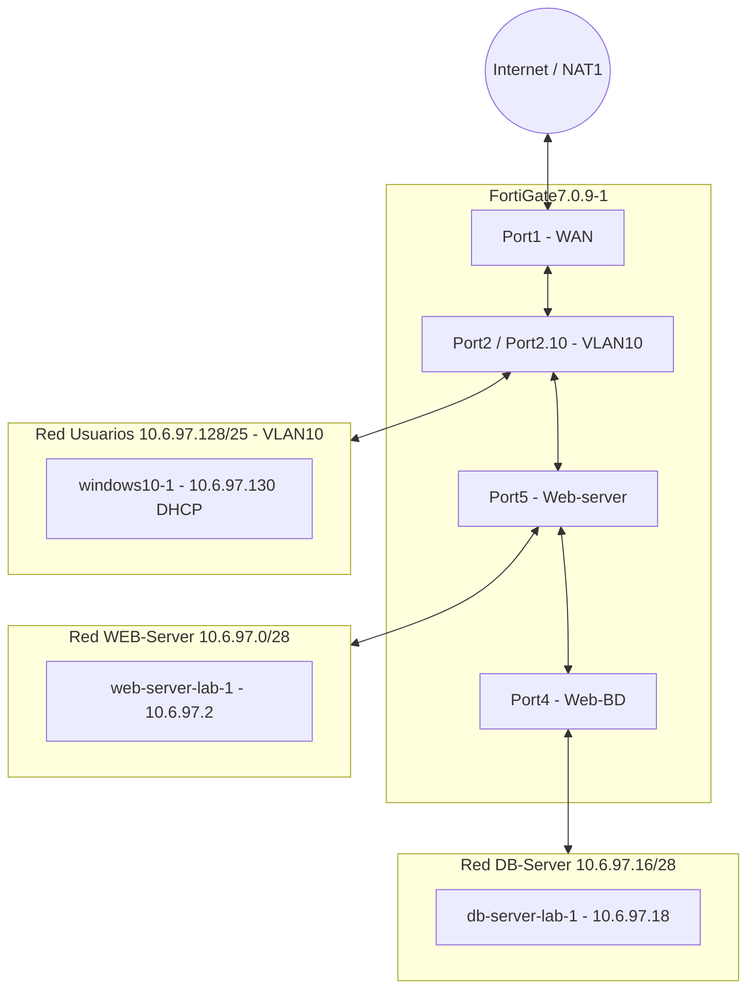
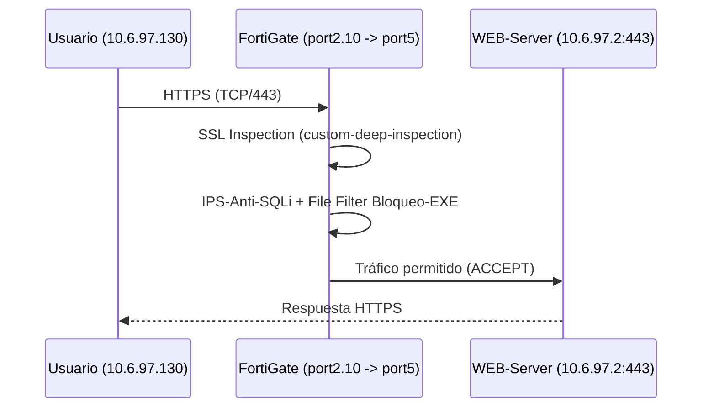
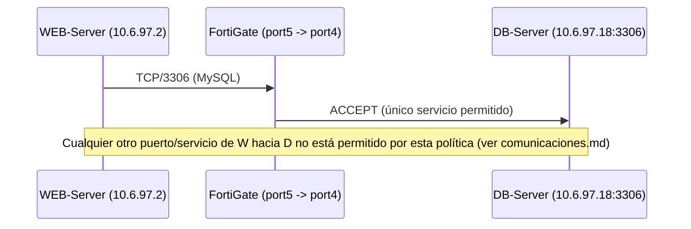
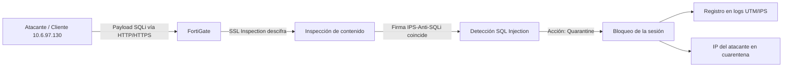
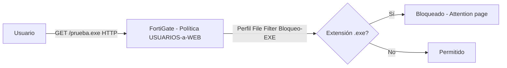

# Diagramas de Flujo de Tráfico

[⬅ Volver al índice principal](../../README.md)

Estos diagramas se derivan directamente de las políticas de firewall documentadas en [`03-fortigate/`](../03-fortigate/) y de la evidencia de pruebas en [`07-pruebas/`](../07-pruebas/). No se añade ningún salto o control que no esté respaldado por una política o evidencia real.

## 1. Diagrama lógico de segmentación

## 2. Flujo Usuarios → WEB-Server (Política `USUARIOS-a-WEB`)

Evidencia de esta política: [`politica-usuarios-web.md`](../03-fortigate/politica-usuarios-web.md).

## 3. Flujo WEB-Server → DB-Server (Política `WEB-a-DB-3306`)

Evidencia: [`comunicaciones.md`](../05-servidores/comunicaciones.md).

## 4. Flujo de ataque SQL Injection y bloqueo

Evidencia: [`sql-injection.md`](../03-fortigate/sql-injection.md) y [`cuarentena.md`](../03-fortigate/cuarentena.md).

## 5. Flujo de bloqueo de descarga `.exe`

Evidencia: [`filtrado-exe.md`](../03-fortigate/filtrado-exe.md).

> [!NOTE]
> No se incluyen diagramas adicionales (por ejemplo, un diagrama físico de racks o cableado) porque el material proporcionado no contiene esa información y no debe inventarse.
