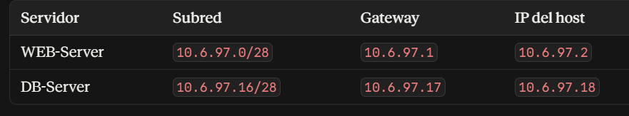
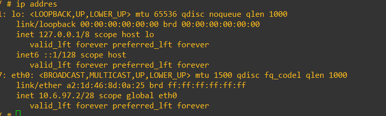

# Direccionamiento IP

[⬅ Volver al índice principal](../../README.md)

## Tabla de direccionamiento

| Segmento | VLAN | Red | Máscara | Gateway | Uso | Evidencia |
|---|---|---|---|---|---|---|
| WEB-Server | No proporcionado (red directa en Port5) | 10.6.97.0/28 | 255.255.255.240 | 10.6.97.1 (Web-server / port5) | Host del servidor web: 10.6.97.2 | [`EVID-TOPO-001`](../../evidence/01-topologia/EVID-TOPO-001.png), [`EVID-FGT-004`](../../evidence/02-fortigate/EVID-FGT-004.png) |
| DB-Server | No proporcionado (red directa en Port4) | 10.6.97.16/28 | 255.255.255.240 | 10.6.97.17 (Web-BD / port4) | Host del servidor de base de datos: 10.6.97.18 | [`EVID-TOPO-001`](../../evidence/01-topologia/EVID-TOPO-001.png), [`EVID-FGT-005`](../../evidence/02-fortigate/EVID-FGT-005.png) |
| Usuarios | VLAN 10 | 10.6.97.128/25 | 255.255.255.128 | 10.6.97.129 (port2.10) | Red de clientes, con DHCP | [`EVID-FGT-006`](../../evidence/02-fortigate/EVID-FGT-006.png), [`EVID-USR-001`](../../evidence/05-usuarios/EVID-USR-001.png) |
| WAN | No aplica | 192.168.42.0/24 | 255.255.255.0 | 192.168.42.1 | Salida a Internet (port1) | [`EVID-FGT-003`](../../evidence/02-fortigate/EVID-FGT-003.png), [`EVID-FGT-002`](../../evidence/02-fortigate/EVID-FGT-002.png) |

## Tabla de direccionamiento de servidores (según captura original del diseño)

*EVID-TOPO-001 es la tabla de diseño provista, que fija: WEB-Server → subred 10.6.97.0/28, gateway 10.6.97.1, IP del host 10.6.97.2; DB-Server → subred 10.6.97.16/28, gateway 10.6.97.17, IP del host 10.6.97.18. Esta tabla es la fuente de verdad del direccionamiento de servidores y coincide con lo verificado en la GUI del FortiGate y en los propios contenedores (ver `ip addr` en [`EVID-WEB-001`](../../evidence/04-servidores/EVID-WEB-001.png)).*

## Detalle de interfaces del FortiGate

| Interfaz | IP / Máscara | Accesos administrativos permitidos | Evidencia |
|---|---|---|---|
| port1 | 192.168.42.206/255.255.255.0 | PING, HTTPS, SSH, HTTP, FMG-Access | [`EVID-FGT-003`](../../evidence/02-fortigate/EVID-FGT-003.png) |
| port2 | 0.0.0.0/0.0.0.0 (interfaz física padre, sin IP propia asignada) | PING, HTTPS, SSH, HTTP | [`EVID-FGT-003`](../../evidence/02-fortigate/EVID-FGT-003.png) |
| port2.10 (VLAN 10) | 10.6.97.129/255.255.255.128 | PING, HTTPS, SSH, (HTTP deshabilitado) | [`EVID-FGT-006`](../../evidence/02-fortigate/EVID-FGT-006.png) |
| port4 (Web-BD) | 10.6.97.17/255.255.255.240 | PING, HTTPS, SSH, FMG-Access | [`EVID-FGT-005`](../../evidence/02-fortigate/EVID-FGT-005.png) |
| port5 (Web-server) | 10.6.97.1/255.255.255.240 | PING, HTTPS, FMG-Access | [`EVID-FGT-004`](../../evidence/02-fortigate/EVID-FGT-004.png) |

## Direccionamiento verificado en el cliente Windows (Usuarios)

*EVID-USR-001 muestra el resultado de `ipconfig` en `windows10-1`: dirección IPv4 `10.6.97.130`, máscara `255.255.255.128` (/25), puerta de enlace predeterminada `10.6.97.129`. Esto confirma que el cliente recibió una dirección dentro del rango DHCP de VLAN 10 y que el gateway coincide con la interfaz `port2.10` del FortiGate.*

## Direccionamiento verificado en el WEB-Server

*EVID-WEB-001 muestra la salida de `ip addr` dentro del contenedor `web-server-lab-1`: la interfaz `eth0` tiene la dirección `10.6.97.2/28`, coincidiendo exactamente con el direccionamiento de diseño (EVID-TOPO-001) y con el objeto de dirección `WEB-Server` del FortiGate (EVID-FGT-008).*

## Notas y limitaciones del material

> [!NOTE]
> - El identificador de VLAN asociado a las subredes de WEB-Server y DB-Server **no fue proporcionado**; el material solo confirma que estas subredes cuelgan de interfaces físicas dedicadas (port4/port5) sin etiquetado 802.1Q documentado.
> - La captura del servidor DB-Server ejecutando `ip addr` (equivalente a EVID-WEB-001 pero para `db-server-lab-1`) **no fue proporcionada**; la IP 10.6.97.18/28 se confirma indirectamente por el banner de MariaDB obtenido al conectar contra ese host y puerto (ver [`EVID-DB-003`](../../evidence/04-servidores/EVID-DB-003.png)) y por el objeto de dirección del FortiGate (EVID-FGT-009).
