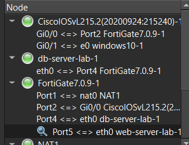
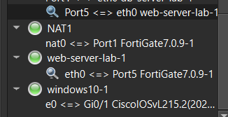
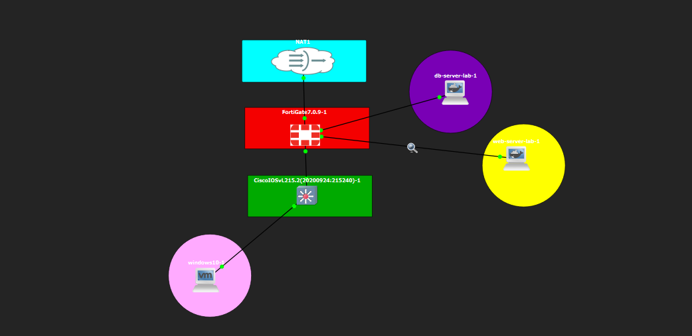

# Topología de Red

[⬅ Volver al índice principal](../../README.md)

## Nodos y enlaces (GNS3)

La topología fue construida y verificada directamente en el proyecto de GNS3. La siguiente lista de nodos y enlaces corresponde exactamente a la vista de "Node" del proyecto:

```
CiscoIOSvL215.2(20200924:215240)-1
  Gi0/0 <=> Port2 FortiGate7.0.9-1
  Gi0/1 <=> e0 windows10-1

db-server-lab-1
  eth0 <=> Port4 FortiGate7.0.9-1

FortiGate7.0.9-1
  Port1 <=> nat0 NAT1
  Port2 <=> Gi0/0 CiscoIOSvL215.2(...)
  Port4 <=> eth0 db-server-lab-1
  Port5 <=> eth0 web-server-lab-1

NAT1
  nat0 <=> Port1 FortiGate7.0.9-1

web-server-lab-1
  eth0 <=> Port5 FortiGate7.0.9-1

windows10-1
  e0 <=> Gi0/1 CiscoIOSvL215.2(...)
```

**Evidencia:**



*EVID-TOPO-003 demuestra, tal como aparece en el panel "Node" de GNS3, cada enlace físico entre el FortiGate y el resto de los dispositivos: Port1 hacia la nube NAT1, Port2 hacia el switch, Port4 hacia el DB-Server y Port5 hacia el WEB-Server.*



*EVID-TOPO-002 confirma, desde otra vista del mismo proyecto, los enlaces `NAT1 nat0 <=> Port1`, `web-server-lab-1 eth0 <=> Port5` y `windows10-1 e0 <=> Gi0/1` del switch.*

## Diagrama gráfico



*EVID-TOPO-004 es la vista gráfica del canvas de GNS3: se aprecian los cinco nodos (NAT1, FortiGate7.0.9-1, CiscoIOSvL215.2, db-server-lab-1, web-server-lab-1) y el cliente windows10-1 colgado del switch, con las líneas de enlace correspondientes a la lista anterior.*

## Resumen de interfaces del FortiGate utilizadas

| Interfaz FortiGate | Conectada a | Rol | Evidencia |
|---|---|---|---|
| Port1 | NAT1 (nube Internet GNS3) | WAN, ruta por defecto | [`EVID-FGT-002`](../../evidence/02-fortigate/EVID-FGT-002.png), [`EVID-FGT-003`](../../evidence/02-fortigate/EVID-FGT-003.png) |
| Port2 | Switch Gi0/0 (trunk) | Interfaz física padre de la VLAN de Usuarios | [`EVID-FGT-003`](../../evidence/02-fortigate/EVID-FGT-003.png), [`EVID-FGT-007`](../../evidence/02-fortigate/EVID-FGT-007.png) |
| Port2.10 | (subinterfaz VLAN de Port2) | Gateway de la red de Usuarios (VLAN 10) | [`EVID-FGT-006`](../../evidence/02-fortigate/EVID-FGT-006.png) |
| Port4 ("Web-BD") | db-server-lab-1 | Gateway de la subred DB-Server | [`EVID-FGT-005`](../../evidence/02-fortigate/EVID-FGT-005.png) |
| Port5 ("Web-server") | web-server-lab-1 | Gateway de la subred WEB-Server | [`EVID-FGT-004`](../../evidence/02-fortigate/EVID-FGT-004.png) |

> [!NOTE]
> Los nombres visibles en la GUI del FortiGate para Port4 y Port5 son literalmente **"Web-BD"** y **"Web-server"** respectivamente (alias de interfaz configurados por el administrador). Se conservan tal como aparecen en las capturas para evitar confusión al contrastar con la GUI real.

## Flujo de tráfico documentado

Ver diagramas de flujo específicos en [`diagrama-red.md`](diagrama-red.md).
