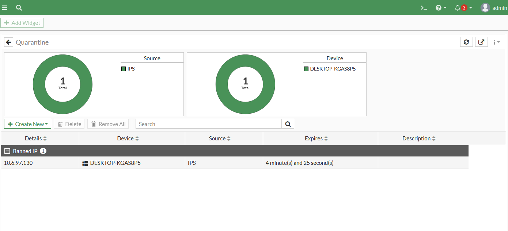

# Cuarentena del Atacante (FGT-08)

[⬅ Volver al índice principal](../../README.md) · [⬅ Volver a FortiGate](configuracion.md)

## Concepto

La cuarentena es una acción de respuesta automática del FortiGate: cuando el motor IPS detecta tráfico que coincide con una firma configurada con acción `Quarantine`, la **dirección IP de origen** del tráfico ofensor se agrega a una lista de baneo temporal. Mientras la IP permanece en cuarentena, el FortiGate bloquea el tráfico proveniente de ella, independientemente del destino o servicio solicitado.

## Qué condición activa la cuarentena

La coincidencia de tráfico proveniente de la red de Usuarios con una firma del perfil IPS `IPS-Anti-SQLi` (ver [`sql-injection.md`](sql-injection.md)), configurado con acción **`Quarantine (Expires 5 Minute(s))`** (ver [`EVID-FGT-016`](../../evidence/02-fortigate/EVID-FGT-016.png)).

## Equipo/usuario afectado

| Campo | Valor |
|---|---|
| IP en cuarentena | `10.6.97.130` |
| Nombre del dispositivo | `DESKTOP-KGAS8P5` |
| Origen del baneo | `IPS` |
| Tiempo restante en el momento de la captura | `4 minute(s) and 25 second(s)` |

## Cómo se verifica

Directamente desde el widget **Quarantine** del panel de FortiGate (`Dashboard > Security > Quarantine` o widget equivalente).

### Evidencia de la cuarentena

*EVID-FGT-023: el widget "Quarantine" muestra 1 IP total baneada, con "Source: IPS" y 1 dispositivo total. En la tabla inferior, "Banned IP" `10.6.97.130`, dispositivo `DESKTOP-KGAS8P5`, fuente `IPS`, y tiempo de expiración `4 minute(s) and 25 second(s)` — consistente con una ventana de cuarentena de 5 minutos que inició segundos antes de esta captura.*

## Qué resultado se obtuvo

Mientras la IP `10.6.97.130` permaneció en cuarentena, cualquier solicitud desde ese equipo hacia el FortiGate fue bloqueada, incluyendo solicitudes HTTP legítimas subsecuentes, mostrando la página de bloqueo específica de intrusión:

*EVID-FGT-024: confirma el efecto práctico de la cuarentena — el navegador del equipo `10.6.97.130` recibe la página de bloqueo del FortiGate ("Your computer has been blocked because an intrusion attack originating from your system was detected") en lugar de cualquier respuesta del servidor de destino, mientras la cuarentena está activa.*

## Correlación temporal (evidencia de consistencia)

La captura de la página de bloqueo (EVID-FGT-024) y la captura del widget de cuarentena (EVID-FGT-023) fueron tomadas con segundos de diferencia entre sí durante la misma sesión de pruebas, y el tiempo restante de cuarentena mostrado (4 min 25 s de una ventana de 5 minutos) es coherente con que el evento de detección de SQL Injection (ver [`sql-injection.md`](sql-injection.md)) ocurrió aproximadamente 35 segundos antes de esa captura — reforzando que ambas evidencias corresponden al mismo incidente.

## Referencias cruzadas

- Requisito: **FGT-08**.
- Depende de: [`sql-injection.md`](sql-injection.md) (mecanismo de detección que dispara la cuarentena).
- Prueba: [`../07-pruebas/prueba-sql-injection.md`](../07-pruebas/prueba-sql-injection.md).
