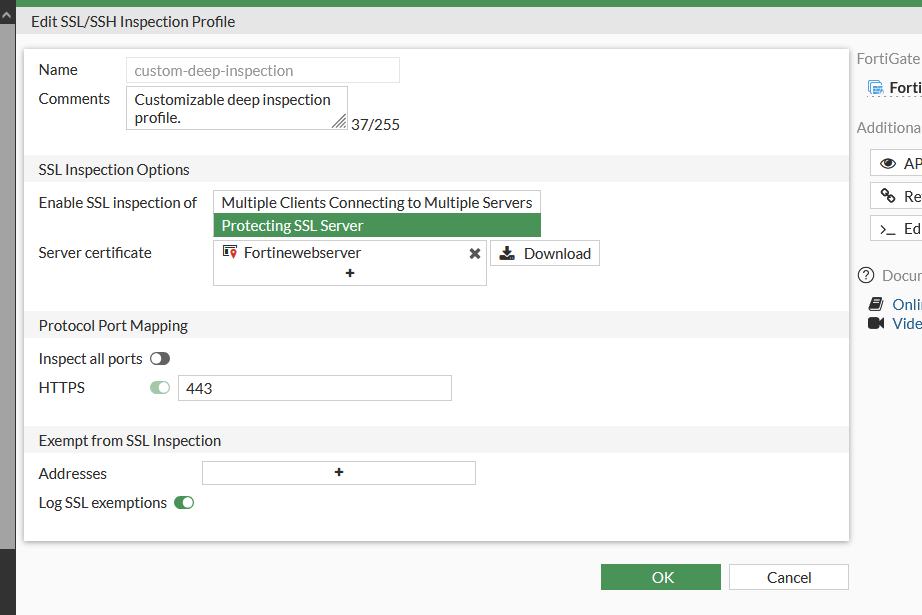

# DPI — Deep Packet Inspection / SSL Inspection (FGT-05)

[⬅ Volver al índice principal](../../README.md) · [⬅ Volver a FortiGate](configuracion.md)

## Concepto

### Explicación conceptual

**DPI (Deep Packet Inspection)** es la capacidad de un firewall de nueva generación de examinar el contenido de los paquetes más allá de las cabeceras de capa 3/4 (IP, puerto), permitiendo identificar aplicaciones, patrones de ataque, firmas de malware y comportamientos anómalos dentro del propio flujo de datos. Cuando el tráfico va cifrado (HTTPS/TLS), esta inspección requiere una capacidad adicional llamada **SSL/SSH Inspection**, que descifra el tráfico en tránsito (actuando el firewall como intermediario de confianza), lo inspecciona en texto claro y vuelve a cifrarlo hacia el destino.

Sin SSL Inspection, un firewall solo vería tráfico HTTPS como bytes cifrados opacos y **no podría** aplicar firmas IPS de capa de aplicación (como las de SQL Injection) sobre el contenido real de las peticiones.

## Implementación (configuración realmente realizada)

- **Dónde se activó**: perfil `SSL/SSH Inspection` llamado `custom-deep-inspection`, en `Security Profiles > SSL/SSH Inspection`.
- **Modo**: `Protecting SSL Server` (el FortiGate actúa protegiendo un servidor SSL propio, no interceptando clientes salientes).
- **Certificado de servidor**: `Fortinewebserver`.
- **Mapeo de puertos**: `HTTPS` habilitado sobre el puerto `443`; `Inspect all ports` deshabilitado (solo se inspecciona específicamente 443).
- **Exenciones**: sin direcciones exentas; `Log SSL exemptions` habilitado.
- **Dónde se aplica**: este perfil está asignado a la política `USUARIOS-a-WEB` (ver [`politica-usuarios-web.md`](politica-usuarios-web.md)), junto con el perfil IPS `IPS-Anti-SQLi`.

### Evidencia de configuración

*EVID-FGT-014 muestra el formulario de edición del perfil `custom-deep-inspection`: modo "Protecting SSL Server", certificado de servidor `Fortinewebserver`, con el puerto HTTPS (443) habilitado para inspección y "Inspect all ports" deshabilitado.*

*EVID-FGT-013 confirma en la tabla de políticas que `Usuarios-a-Internet`/`USUARIOS-a-WEB` tienen el perfil SSL asignado (columna "Security Profiles").*

## Qué tráfico inspecciona

Únicamente el tráfico HTTPS (TCP/443) de las políticas donde el perfil está asignado — en este caso, el tráfico entre `RED-Usuarios` y `WEB-Server` (política `USUARIOS-a-WEB`) y el tráfico saliente hacia Internet (política `Usuarios-a-Internet`, que usa el perfil `certificate-inspection` — ver [`EVID-FGT-013`](../../evidence/02-fortigate/EVID-FGT-013.png)).

> [!NOTE]
> La política `WEB-a-DB-3306` (WEB-Server → DB-Server) tiene asignado el perfil `SSL: no-inspection` (ver [`EVID-FGT-011`](../../evidence/02-fortigate/EVID-FGT-011.png)), es decir, explícitamente **sin** inspección SSL sobre el tráfico de base de datos, lo cual es coherente porque MySQL/MariaDB no utiliza TLS en este laboratorio.

## Cómo se verificó

La verificación funcional de que el DPI/SSL Inspection está activo y operando se demuestra por el hecho de que el perfil IPS `IPS-Anti-SQLi` — que depende de que el tráfico HTTPS esté descifrado para poder inspeccionar el contenido de la petición — detectó y bloqueó efectivamente un payload de SQL Injection embebido en una URL (ver [`sql-injection.md`](sql-injection.md)). Esto **no sería posible sin SSL Inspection activo**, ya que de otro modo el IPS solo vería tráfico cifrado.

### Evidencia de funcionamiento

*EVID-FGT-020: log de intrusión (`HTTP.URI.SQL.Injection`) generado por el motor IPS, lo que confirma que el contenido de la petición HTTP/HTTPS fue efectivamente inspeccionado a nivel de aplicación.*

## Diferenciación explícita

- **Explicación conceptual**: DPI/SSL Inspection permite inspeccionar contenido cifrado descifrándolo en el firewall.
- **Configuración realmente realizada**: perfil `custom-deep-inspection` en modo "Protecting SSL Server" sobre el puerto 443, aplicado a la política `USUARIOS-a-WEB` junto con IPS `IPS-Anti-SQLi`.
- **Verificación**: detección exitosa de un payload SQLi (ver [`sql-injection.md`](sql-injection.md)), lo que confirma que la inspección profunda estaba efectivamente operativa y no solo configurada.

## Referencias cruzadas

- Requisito: **FGT-05**.
- Relacionado: [`sql-injection.md`](sql-injection.md), [`politica-usuarios-web.md`](politica-usuarios-web.md).
