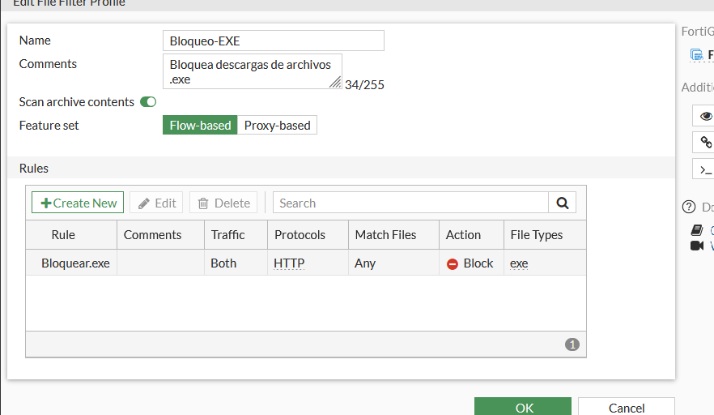
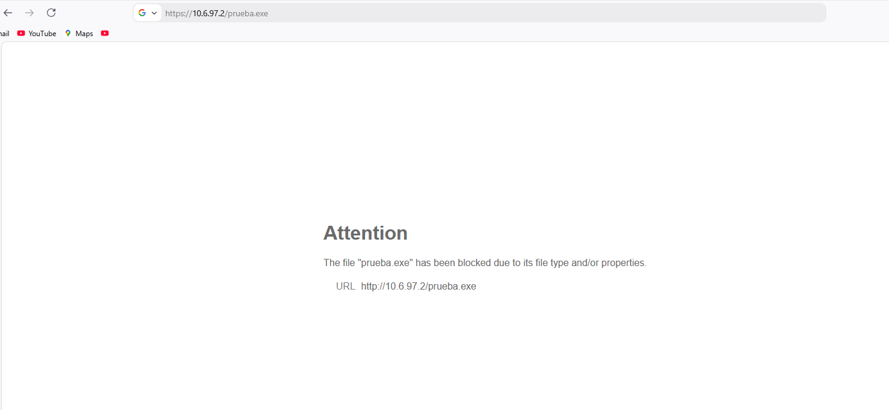
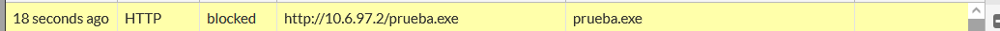
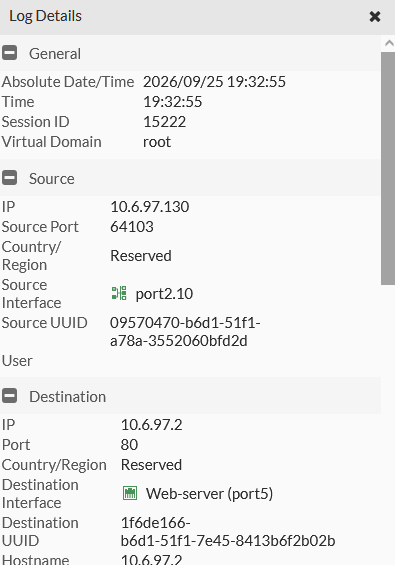

# Filtrado de Archivos `.exe` (FGT-14)

[⬅ Volver al índice principal](../../README.md) · [⬅ Volver a FortiGate](configuracion.md)

## Objetivo

Impedir que los usuarios descarguen archivos ejecutables (`.exe`) desde el servidor web, como control de mitigación frente a la distribución de malware a través de la aplicación.

## Tráfico web afectado

Tráfico HTTP/HTTPS de la política `USUARIOS-a-WEB` (`port2.10 → Web-server (port5)`), donde está asignado el perfil de filtrado de archivos.

## Mecanismo de filtrado

Perfil **File Filter** de FortiGate, que inspecciona el tráfico y compara el tipo de archivo real (no solo la extensión en la URL) contra reglas configuradas.

## Regla / perfil utilizado

*EVID-FGT-015 muestra el perfil `Bloqueo-EXE`: "Scan archive contents" habilitado, Feature set `Flow-based`, con una regla llamada `Bloquear.exe` que aplica sobre tráfico `Both` (ambas direcciones), protocolo `HTTP`, `Match Files: Any`, acción **`Block`**, tipo de archivo `exe`.*

## Tipo de archivo objetivo

`.exe` (ejecutables de Windows), según la regla `Bloquear.exe` visible en la captura anterior.

## Acción de bloqueo

`Block`: el FortiGate interrumpe la transferencia del archivo en cuanto identifica, por inspección de contenido, que el archivo transferido es del tipo bloqueado.

## Archivo de prueba

Se incluyó en la imagen del `WEB-Server` un archivo de prueba llamado `test.exe` (copia de `/bin/ls` renombrada, ver [`scripts/web-server/build-web-server.sh`](../../scripts/web-server/build-web-server.sh)). Adicionalmente, durante las pruebas se intentó descargar un archivo llamado `prueba.exe` desde `WEB-Server`.

## Prueba realizada

### Intento de descarga desde el navegador

*EVID-WEB-003: al navegar a `https://10.6.97.2/prueba.exe`, el FortiGate reemplaza el contenido con la página de reemplazo estándar: **"Attention — The file 'prueba.exe' has been blocked due to its file type and/or properties. URL: http://10.6.97.2/prueba.exe"**.*

### Log del File Filter

*EVID-FGT-025: entrada en la lista de logs, tipo `HTTP`, acción **`blocked`**, con la URL `http://10.6.97.2/prueba.exe` y el nombre de archivo `prueba.exe` en la columna correspondiente, registrada hace "18 seconds ago" respecto al momento de la captura.*

### Detalle de la sesión asociada

*EVID-FGT-022: detalle de la sesión (`Session ID 15222`, fecha `2026-09-25 19:32:55`) con origen `10.6.97.130:64103` sobre la interfaz `port2.10`, y destino `10.6.97.2:80` sobre la interfaz `Web-server (port5)` — consistente en tiempo y destino con el bloqueo de `prueba.exe` documentado arriba.*

## Log (resumen)

| Fecha/Hora | Origen | Destino | Servicio | Evento | Acción | Resultado | Evidencia |
|---|---|---|---|---|---|---|---|
| 2026-09-25 19:32:55 (sesión 15222) | 10.6.97.130 | WEB-Server 10.6.97.2:80 | HTTP | Descarga de `prueba.exe` | `blocked` | Archivo bloqueado, usuario recibe página de reemplazo | [`EVID-FGT-025`](../../evidence/07-logs/EVID-FGT-025.png), [`EVID-FGT-022`](../../evidence/07-logs/EVID-FGT-022.png), [`EVID-WEB-003`](../../evidence/04-servidores/EVID-WEB-003.png) |

## Referencias cruzadas

- Requisito: **FGT-14**.
- Perfil asignado en: [`politica-usuarios-web.md`](politica-usuarios-web.md).
- Prueba formal: [`../07-pruebas/prueba-filtrado-exe.md`](../07-pruebas/prueba-filtrado-exe.md).
