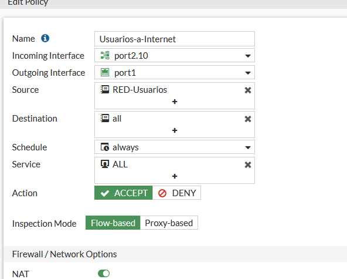
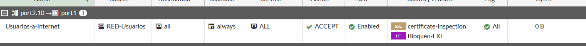

# NAT (FGT-02)

[⬅ Volver al índice principal](../../README.md) · [⬅ Volver a FortiGate](configuracion.md)

## Concepto

NAT (Network Address Translation) permite que equipos con direcciones IP privadas (como los de la red de Usuarios, `10.6.97.128/25`) accedan a Internet traduciendo su dirección de origen a la dirección pública/WAN del FortiGate (`port1`, `192.168.42.206`). Sin NAT, las respuestas de Internet no podrían enrutarse de vuelta a las direcciones privadas internas.

## Qué tráfico utiliza NAT

Únicamente el tráfico que sale de la red de Usuarios hacia Internet a través de la política **`Usuarios-a-Internet`** (interfaz de entrada `port2.10`, salida `port1`). El tráfico interno entre segmentos (`USUARIOS-a-WEB`, `WEB-a-DB-3306`) tiene el NAT **deshabilitado**, ya que no necesita traducción (todas las subredes son directamente alcanzables por el FortiGate).

## Política que utiliza NAT

*EVID-FGT-012 muestra el formulario de edición de la política `Usuarios-a-Internet`: Incoming Interface `port2.10`, Outgoing Interface `port1`, Source `RED-Usuarios`, Destination `all`, Service `ALL`, Action `ACCEPT`, Inspection Mode `Flow-based`, y el interruptor **NAT habilitado (verde)** en la sección "Firewall / Network Options".*

*EVID-FGT-013 confirma en la tabla de políticas que `Usuarios-a-Internet` (port2.10 → port1) tiene la columna **NAT = Enabled**, con los perfiles de seguridad `SSL:certificate-inspection` y `FF:Bloqueo-EXE` aplicados, acción `ACCEPT` y registro (`Log`) en `All`.*

## Configuración realizada en GUI

- **Nombre de la política**: `Usuarios-a-Internet`.
- **Incoming Interface**: `port2.10`.
- **Outgoing Interface**: `port1`.
- **Source**: `RED-Usuarios`.
- **Destination**: `all`.
- **Service**: `ALL`.
- **Action**: `ACCEPT`.
- **NAT**: habilitado (usa la IP de salida de `port1`, NAT de origen dinámico/"overload" estándar del FortiGate).

## Resultado de la prueba

### Evidencia de funcionamiento

*EVID-USR-002: `ping 10.6.97.129` (gateway de VLAN10) exitoso desde `windows10-1`, confirmando conectividad de capa 3 hacia el FortiGate previo a la salida por NAT.*

*EVID-USR-003: `ping 8.8.8.8` exitoso (4/4 paquetes recibidos) desde `windows10-1`, demostrando que el tráfico de la red de Usuarios llega a Internet correctamente traducido por NAT en `port1`.*

## Referencias cruzadas

- Requisito: **FGT-02**.
- Depende de: [`ruta-default.md`](ruta-default.md).
- Prueba relacionada: [`../07-pruebas/pruebas-conectividad.md`](../07-pruebas/pruebas-conectividad.md).
