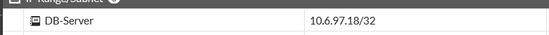

# Política 2 — Usuarios → DB-Server (Bloqueo) (FGT-04)

[⬅ Volver al índice principal](../../README.md) · [⬅ Volver a FortiGate](configuracion.md)

## Concepto

Esta política implementa el control de acceso que **impide explícitamente** que los equipos de la red de Usuarios se comuniquen directamente con el servidor de base de datos por su puerto de servicio (TCP/3306, MySQL/MariaDB). Esto obliga a que cualquier acceso a los datos pase necesariamente por la lógica de la aplicación web, y no directamente contra el motor de base de datos.

## Implementación (`BLOQUEO-Usuarios-a-DB`)

| Campo | Valor |
|---|---|
| Interfaz de entrada | `port2.10` |
| Interfaz de salida | `Web-BD (port4)` |
| Origen | `RED-Usuarios` (10.6.97.128/25) |
| Destino | `DB-Server` (10.6.97.18/32) |
| Servicio | `MySQL-3306` |
| Acción | **DENY** |
| Log | `All` |
| Bytes registrados | 0 B |

### Evidencia de configuración

*EVID-FGT-011: primera fila de la tabla de políticas, `BLOQUEO-Usuarios-a-DB`, del segmento `port2.10 → Web-BD (port4)`, con acción **DENY** para el servicio `MySQL-3306` desde `RED-Usuarios` hacia `DB-Server`.*

*EVID-FGT-009: objeto de dirección de destino `DB-Server` = 10.6.97.18/32, usado en esta política.*

## Confirmación: los usuarios NO pueden acceder directamente al DB-Server por TCP/3306

> [!NOTE]
> **Los usuarios NO deben poder acceder directamente al DB-Server mediante TCP/3306.** Esta condición está garantizada por la política `BLOQUEO-Usuarios-a-DB` (acción DENY) y fue verificada activamente desde el cliente de la red de Usuarios.

### Prueba de bloqueo

*EVID-TEST-003: `Test-NetConnection 10.6.97.18 -Port 3306` ejecutado desde el cliente de Usuarios (`10.6.97.130`) resulta en `TcpTestSucceeded: False` y `PingSucceeded: False` (timeout), confirmando que la política de bloqueo está activa y es efectiva.*

## Logs

Los `Bytes` registrados en la tabla de políticas (EVID-FGT-011) muestran **0 B** para esta regla, lo que es consistente con una política de tipo `DENY`: FortiGate deniega la sesión en el momento del intento de conexión (no se establece TCP handshake), por lo que no hay bytes de datos de aplicación transmitidos, únicamente el registro del evento de bloqueo asociado a la política.

## Referencias cruzadas

- Requisito: **FGT-04**.
- Complementa: [`../05-servidores/comunicaciones.md`](../05-servidores/comunicaciones.md) (que documenta la comunicación permitida WEB-Server ↔ DB-Server).
- Prueba: [`../07-pruebas/pruebas-politicas.md`](../07-pruebas/pruebas-politicas.md).
