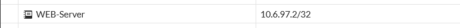

# Política 1 — Usuarios → WEB-Server (FGT-03)

[⬅ Volver al índice principal](../../README.md) · [⬅ Volver a FortiGate](configuracion.md)

## Concepto

Esta política permite el acceso legítimo de los usuarios de la VLAN 10 a la aplicación web publicada en `WEB-Server`, restringido exclusivamente al protocolo HTTPS (TCP/443), con inspección de seguridad activa.

## Implementación (`USUARIOS-a-WEB`)

| Campo | Valor |
|---|---|
| Interfaz de entrada | `port2.10` |
| Interfaz de salida | `Web-server (port5)` |
| Origen | `RED-Usuarios` (10.6.97.128/25) |
| Destino | `WEB-Server` (10.6.97.2/32) |
| Servicio | `HTTPS-443` |
| Acción | `ACCEPT` |
| NAT | Disabled |
| Perfiles de seguridad | `APP: default`, `IPS: IPS-Anti-SQLi`, `SSL: custom-deep-inspection`, `FF: Bloqueo-EXE` |
| Log | `All` |
| Bytes registrados | 59.33 kB |

### Evidencia de configuración

*EVID-FGT-011: fila `USUARIOS-a-WEB`, política del segmento `port2.10 → Web-server (port5)`, con acción `ACCEPT`, NAT `Disabled` y los cuatro perfiles de seguridad (APP, IPS, SSL, FF) activos.*

*EVID-FGT-008: objeto de dirección de destino `WEB-Server` = 10.6.97.2/32, usado en esta política.*

*EVID-FGT-010: objeto de dirección de origen `RED-Usuarios` = 10.6.97.128/25, usado en esta política.*

## DPI / SSL Inspection asociada

El perfil `SSL: custom-deep-inspection` aplicado en esta política habilita la inspección profunda del tráfico HTTPS (ver detalle completo en [`dpi.md`](dpi.md)), lo que permite que el perfil IPS (`IPS-Anti-SQLi`) inspeccione el contenido descifrado de las peticiones HTTP/HTTPS en busca de patrones de SQL Injection.

## Evidencia de funcionamiento

### Conectividad HTTPS exitosa

*EVID-TEST-001: `Test-NetConnection 10.6.97.2 -Port 443` desde el cliente de Usuarios (`10.6.97.130`) resulta en `TcpTestSucceeded: True`, confirmando que la política permite el tráfico HTTPS.*

*EVID-TEST-005: el historial del navegador confirma un acceso exitoso a `https://10.6.97.2` (entrada "Apache2 Ubuntu Default Page: It works" / página de la aplicación), demostrando la política en la práctica.*

### Contraprueba — HTTP (puerto 80) no está autorizado por esta política

*EVID-TEST-002: `Test-NetConnection 10.6.97.2 -Port 80` desde Usuarios falla (`TcpTestSucceeded: False`, timeout), reforzando que el servicio autorizado explícitamente por la política es únicamente `HTTPS-443`.*

*EVID-TEST-004: el navegador reporta "La conexión ha caducado" al intentar `http://10.6.97.2`, consistente con el resultado anterior.*

> [!NOTE]
> El material también incluye evidencia de tráfico y eventos IPS asociados al puerto 80 hacia `WEB-Server` (ver logs en [`sql-injection.md`](sql-injection.md) y [`filtrado-exe.md`](filtrado-exe.md)), producto de las pruebas de ataque realizadas directamente con herramientas como `curl`/navegador/`Invoke-WebRequest`. El detalle exacto de si dichas sesiones fueron evaluadas por esta política o quedaron sujetas a la denegación implícita no pudo confirmarse con el nivel de detalle del material disponible (**dato no proporcionado**); se documenta la evidencia tal como fue entregada.

## Referencias cruzadas

- Requisito: **FGT-03**.
- Perfiles de seguridad: [`dpi.md`](dpi.md), [`sql-injection.md`](sql-injection.md), [`filtrado-exe.md`](filtrado-exe.md).
- Pruebas: [`../07-pruebas/pruebas-politicas.md`](../07-pruebas/pruebas-politicas.md).
