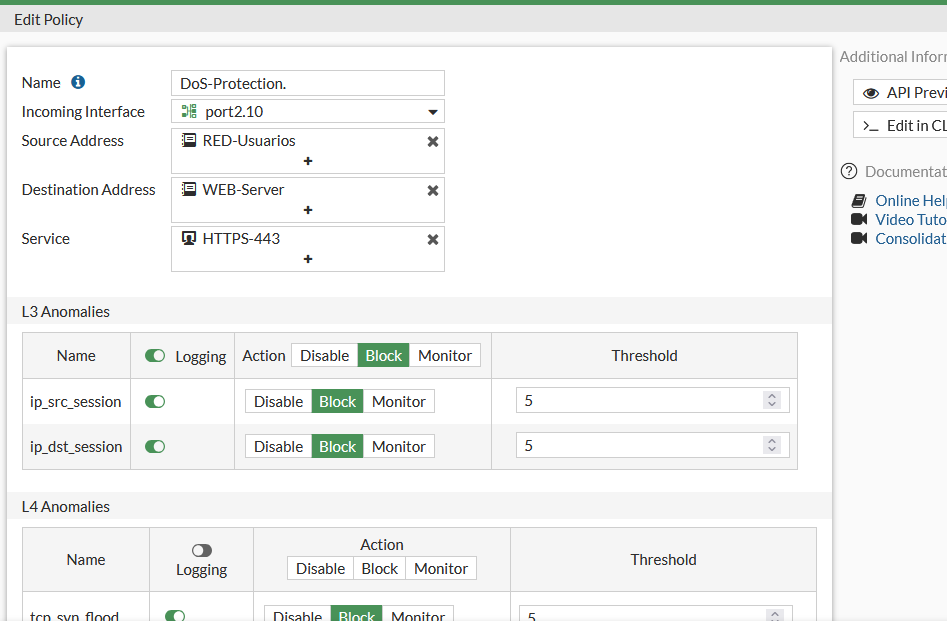
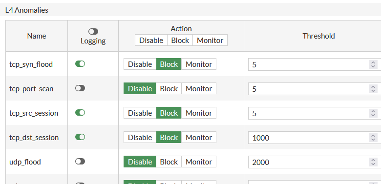
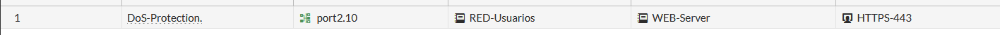
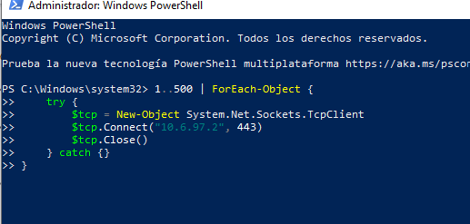
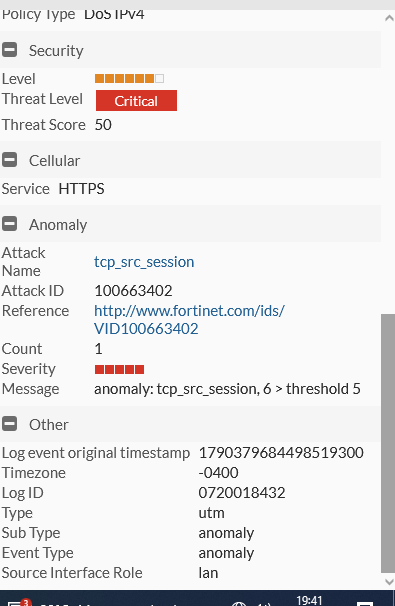
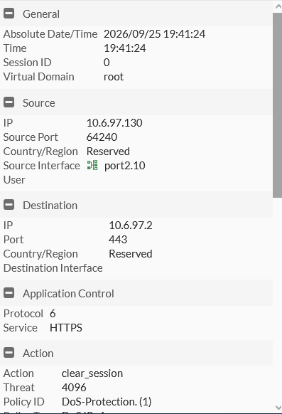
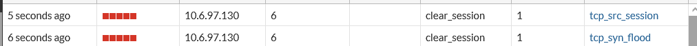

# Rate Limiting / Mitigación de DoS (FGT-15)

[⬅ Volver al índice principal](../../README.md) · [⬅ Volver a FortiGate](configuracion.md)

## Objetivo

Mitigar ataques de denegación de servicio (DoS) contra `WEB-Server`, limitando la tasa de sesiones/paquetes anómalos que un mismo origen puede generar hacia el servicio HTTPS.

## Qué tráfico se limita

Tráfico entrante hacia `WEB-Server` (10.6.97.2) por el servicio `HTTPS-443`, proveniente de `RED-Usuarios`, a través de la interfaz `port2.10`.

## Dónde se configuró

Política de tipo **DoS Policy (IPv4)** llamada `DoS-Protection.`, en `Policy & Objects > IPv4 DoS Policy` (o equivalente en la versión de GUI utilizada).

## Parámetros utilizados



*EVID-FGT-017: formulario de la política `DoS-Protection.`, con Incoming Interface `port2.10`, Source Address `RED-Usuarios`, Destination Address `WEB-Server`, Service `HTTPS-443`. Sección **L3 Anomalies**: `ip_src_session` y `ip_dst_session`, ambas con Logging habilitado, Acción `Block`, Threshold `5`.*



*EVID-FGT-018: sección **L4 Anomalies** de la misma política:*

| Anomalía | Logging | Acción | Threshold |
|---|---|---|---|
| `tcp_syn_flood` | Habilitado | **Block** | 5 |
| `tcp_port_scan` | Deshabilitado | Block (configurado, logging apagado) | 5 |
| `tcp_src_session` | Habilitado | **Block** | 5 |
| `tcp_dst_session` | Habilitado | **Block** | 1000 |
| `udp_flood` | Deshabilitado | Block (configurado, logging apagado) | 2000 |



*EVID-FGT-019: la política `DoS-Protection.` aparece en la tabla de políticas del segmento `port2.10`, con origen `RED-Usuarios`, destino `WEB-Server`, servicio `HTTPS-443`.*

## Mecanismo empleado

FortiGate **DoS Policy** con detección de anomalías de capa 3 (por sesión de IP origen/destino) y de capa 4 (SYN flood, escaneo de puertos, sesiones por origen/destino, flood UDP). Cuando el conteo de eventos supera el `Threshold` configurado dentro de la ventana de medición del FortiGate, se ejecuta la acción `Block`, que en la práctica se traduce en la terminación (`clear_session`) de las sesiones del origen ofensor.

## Cómo se verificó

### Generación de tráfico de prueba



*EVID-WEB-004: script ejecutado en PowerShell desde el cliente de Usuarios, que abre secuencialmente hasta 500 conexiones TCP hacia `10.6.97.2:443`:*
```powershell
1..500 | ForEach-Object {
    try {
        $tcp = New-Object System.Net.Sockets.TcpClient
        $tcp.Connect("10.6.97.2", 443)
        $tcp.Close()
    } catch {}
}
```
*Este script simula un patrón de múltiples sesiones TCP rápidas desde un mismo origen hacia el mismo destino/puerto, diseñado para exceder el `Threshold` de las anomalías `tcp_src_session`/`tcp_syn_flood` (ambas configuradas en 5).*

### Resultado: anomalía detectada y sesión terminada



*EVID-FGT-026: detalle de log de tipo `DoS IPv4` — Threat Level **`Critical`**, Threat Score `50`, Servicio `HTTPS`, Anomaly Attack Name `tcp_src_session`, Attack ID `100663402`, Count `1`, Mensaje **`anomaly: tcp_src_session, 6 > threshold 5`** — confirmando textualmente que el conteo de sesiones (6) superó el umbral configurado (5), disparando la anomalía.*



*EVID-FGT-027: General — fecha `2026-09-25 19:41:24`; Source IP `10.6.97.130` puerto `64240`, interfaz `port2.10`; Destination IP `10.6.97.2` puerto `443`; Servicio `HTTPS`; **Action: `clear_session`**; Threat `4096`; Policy ID `DoS-Protection. (1)` — confirmando que la propia política `DoS-Protection` terminó activamente la sesión ofensora.*



*EVID-FGT-028: lista de logs mostrando dos eventos consecutivos contra el origen `10.6.97.130`: uno con acción `clear_session` y anomalía `tcp_src_session`, y otro con acción `clear_session` y anomalía `tcp_syn_flood`, ambos con severidad alta (5 barras), a segundos de diferencia entre sí.*

## Log (resumen)

| Fecha/Hora | Origen | Destino | Servicio | Evento | Acción | Resultado | Evidencia |
|---|---|---|---|---|---|---|---|
| 2026-09-25 19:41:24 | 10.6.97.130:64240 | WEB-Server 10.6.97.2:443 | HTTPS | Anomalía `tcp_src_session` (6 > umbral 5) | `clear_session` | Sesión del atacante terminada por la política DoS-Protection | [`EVID-FGT-026`](../../evidence/07-logs/EVID-FGT-026.png), [`EVID-FGT-027`](../../evidence/07-logs/EVID-FGT-027.png) |
| (segundos después) | 10.6.97.130 | WEB-Server 10.6.97.2 | HTTPS | Anomalía `tcp_syn_flood` | `clear_session` | Sesión terminada | [`EVID-FGT-028`](../../evidence/07-logs/EVID-FGT-028.png) |

> [!NOTE]
> El valor exacto de "rate limit" en el sentido de paquetes/segundo o conexiones/segundo permitidas de forma sostenida (más allá de los `Threshold` de sesiones concurrentes documentados arriba: 5 para `tcp_syn_flood`/`tcp_src_session`, 1000 para `tcp_dst_session`, 2000 para `udp_flood`) **no fue proporcionado adicionalmente en el material disponible**. El mecanismo de mitigación implementado y verificado es la **DoS Policy de FortiGate basada en anomalías L3/L4**, documentada íntegramente arriba con sus umbrales reales.

## Referencias cruzadas

- Requisito: **FGT-15**.
- Prueba formal: [`../07-pruebas/prueba-rate-limit.md`](../07-pruebas/prueba-rate-limit.md).
