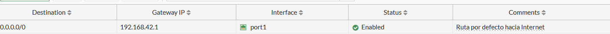
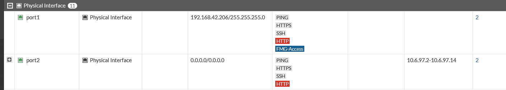

# Ruta por Defecto (FGT-01)

[⬅ Volver al índice principal](../../README.md) · [⬅ Volver a FortiGate](configuracion.md)

## Concepto

Una ruta por defecto (`0.0.0.0/0.0.0.0`) indica al FortiGate hacia qué *gateway* enviar cualquier paquete cuyo destino no coincida con ninguna ruta más específica (por ejemplo, tráfico hacia Internet). Sin esta ruta, los segmentos internos (Usuarios, WEB-Server, DB-Server) no tendrían salida hacia redes externas.

## Implementación

- **Dónde se configuró**: `Network > Static Routes` en la GUI del FortiGate.
- **Parámetros configurados**:
  - Destino: `0.0.0.0/0`
  - Gateway IP: `192.168.42.1`
  - Interfaz de salida: `port1`
  - Estado: `Enabled`
  - Comentario: *"Ruta por defecto hacia Internet"*

### Evidencia de configuración

*EVID-FGT-002 muestra la tabla `Static Routes` del FortiGate con la ruta `0.0.0.0/0` habilitada (`Enabled`), gateway `192.168.42.1` a través de la interfaz `port1`, con el comentario "Ruta por defecto hacia Internet".*

*EVID-FGT-003 confirma que `port1` tiene IP `192.168.42.206/255.255.255.0`, consistente con estar en la misma subred que el gateway `192.168.42.1` de la ruta por defecto.*

## Verificación

La verificación funcional de esta ruta se demuestra indirectamente mediante la conectividad exitosa desde el cliente de Usuarios hacia Internet (a través de la política `Usuarios-a-Internet`, que depende de esta ruta para poder salir por `port1`):

### Evidencia de funcionamiento

*EVID-USR-003: `ping 8.8.8.8` desde `windows10-1` responde exitosamente (4/4 paquetes, 0% pérdida), lo cual solo es posible si el FortiGate está reenviando el tráfico hacia Internet mediante la ruta por defecto configurada en `port1`.*

## Referencias cruzadas

- Requisito: **FGT-01** (ver [`requisitos.md`](../01-introduccion/requisitos.md)).
- Relacionado con: [`nat.md`](nat.md) (la ruta por defecto es condición necesaria para que el NAT de salida funcione).
- Prueba relacionada: [`../07-pruebas/pruebas-conectividad.md`](../07-pruebas/pruebas-conectividad.md).
