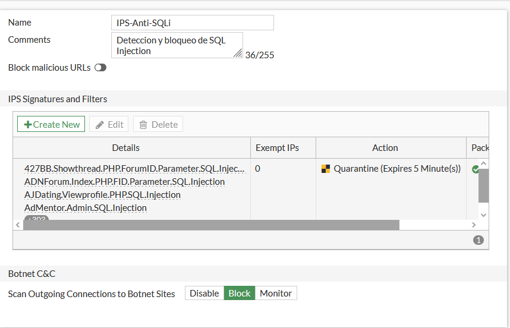
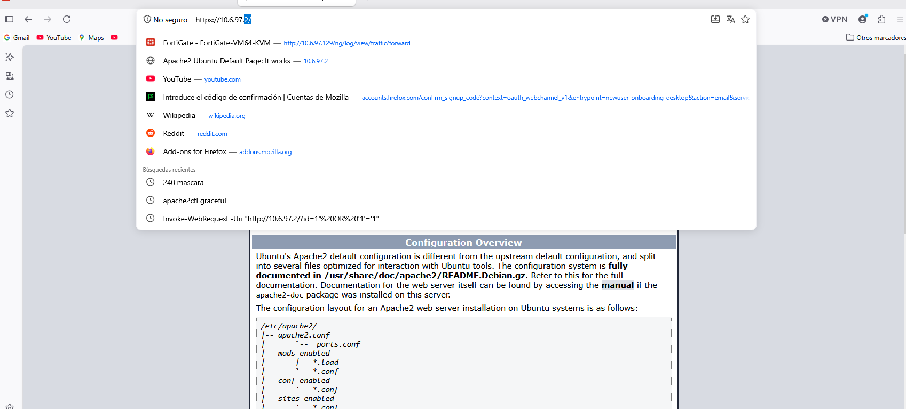
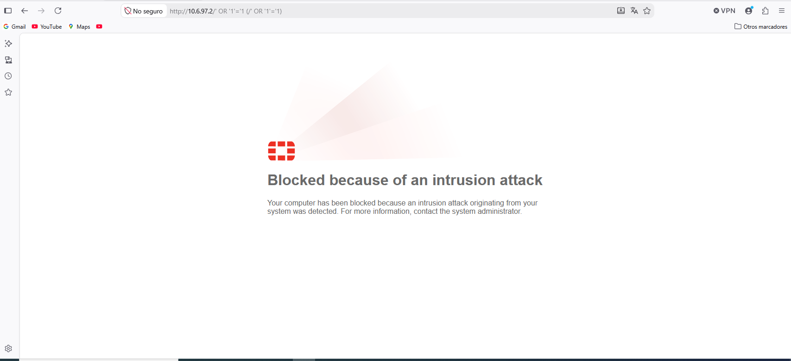
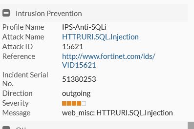
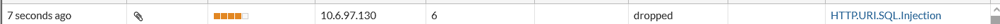

# Detección y Bloqueo de SQL Injection (FGT-06, FGT-07, FGT-09, FGT-10, FGT-11)

[⬅ Volver al índice principal](../../README.md) · [⬅ Volver a FortiGate](configuracion.md)

Esta es una de las secciones más críticas del laboratorio: cubre la creación de la regla de detección (FGT-06), el bloqueo (FGT-07), la generación de tráfico de prueba (FGT-09), la demostración del bloqueo (FGT-10) y la demostración de logs (FGT-11).

## 1. Objetivo

Detectar y bloquear, en tiempo real, intentos de explotación de **SQL Injection** dirigidos contra la aplicación web de `WEB-Server`, sin depender de que la propia aplicación valide correctamente sus entradas.

## 2. Activo protegido

`WEB-Server` (10.6.97.2), específicamente el script `search.php`, que construye una consulta SQL concatenando directamente el parámetro `id` recibido por GET (ver [`../05-servidores/web-server.md`](../05-servidores/web-server.md) y el código fuente en [`scripts/web-server/build-web-server.sh`](../../scripts/web-server/build-web-server.sh)):

```php
$id = $_GET['id'] ?? 1;
$r = $c->query("SELECT id,name FROM users WHERE id=$id");
```

Esta página fue construida **intencionalmente vulnerable** (comentario en el propio script: *"Pagina vulnerable a proposito (SOLO laboratorio controlado) para probar el IPS/SQLi"*), de modo que el control de seguridad efectivo recae en el FortiGate y no en la aplicación.

## 3. Tráfico inspeccionado

Tráfico HTTP/HTTPS dirigido a `WEB-Server` que atraviesa la política `USUARIOS-a-WEB` (ver [`politica-usuarios-web.md`](politica-usuarios-web.md)), previamente descifrado por el perfil SSL Inspection `custom-deep-inspection` (ver [`dpi.md`](dpi.md)).

## 4. Mecanismo de detección

Perfil **IPS (Intrusion Prevention System)** llamado `IPS-Anti-SQLi`, con firmas predefinidas de Fortinet para SQL Injection.

### Regla / perfil utilizado



*EVID-FGT-016 muestra el perfil IPS `IPS-Anti-SQLi`, con la lista de firmas activas incluyendo (visibles en la captura): `427BB.Showthread.PHP.ForumID.Parameter.SQL.Injection`, `ADNForum.Index.PHP.FID.Parameter.SQL.Injection`, `AJDating.Viewprofile.PHP.SQL.Injection`, `AdMentor.Admin.SQL.Injection`, entre otras (el listado completo de firmas de la base de firmas de Fortinet contiene más de 1200 entradas, según el contador visible en la esquina inferior de la tabla). La acción configurada para estas firmas es **Quarantine (Expires 5 Minute(s))**. Adicionalmente, "Botnet C&C: Scan Outgoing Connections to Botnet Sites" está en modo `Block`.*

## 5. Acción de bloqueo

Cuando el tráfico coincide con una firma de SQL Injection, el IPS ejecuta la acción configurada: **bloquear la sesión (drop) y poner en cuarentena la IP de origen durante 5 minutos** (ver detalle completo del mecanismo de cuarentena en [`cuarentena.md`](cuarentena.md)).

## 6. Mecanismo de cuarentena

Resumido aquí y detallado en [`cuarentena.md`](cuarentena.md): la acción `Quarantine` del perfil IPS añade la IP de origen atacante a la lista de cuarentena del FortiGate por 5 minutos, bloqueando cualquier tráfico adicional de esa IP durante ese periodo.

## 7. Generación del tráfico de prueba

Se generaron payloads de SQL Injection clásicos de tipo *tautología* (`' OR '1'='1`) contra el parámetro `id` de `search.php`, desde dos vías documentadas:

1. **PowerShell `Invoke-WebRequest`** (visible en el historial de búsquedas/autocompletado del navegador):
   ```
   Invoke-WebRequest -Uri "http://10.6.97.2/?id=1'%20OR%20'1'='1"
   ```
2. **Barra de direcciones del navegador**, apuntando directamente a la URL con el payload:
   ```
   http://10.6.97.2/' OR '1'='1  (codificado como /' OR '1'='1)
   ```

### Evidencia del payload utilizado



*EVID-TEST-005: el desplegable de autocompletado de la barra de direcciones de Firefox muestra, entre las búsquedas recientes, la línea `Invoke-WebRequest -Uri "http://10.6.97.2/?id=1'%20OR%20'1'='1"`, confirmando exactamente el payload de SQL Injection generado como prueba.*

> [!NOTE]
> No se proporcionó una captura de la salida cruda de dicho `Invoke-WebRequest` (por ejemplo, el cuerpo de la respuesta HTTP). **Evidencia pendiente de incorporar.**

## 8. Resultado: bloqueo demostrado (FGT-10)



*EVID-FGT-024: al intentar acceder desde el navegador a `http://10.6.97.2/' OR '1'='1` (visible en la barra de direcciones), el FortiGate intercepta la solicitud y devuelve la página de réplica **"Blocked because of an intrusion attack — Your computer has been blocked because an intrusion attack originating from your system was detected. For more information, contact the system administrator."** Esta es la evidencia directa de que el FortiGate bloqueó el intento de SQL Injection y, adicionalmente, puso en cuarentena al equipo de origen (por eso el mensaje indica que "su equipo" fue bloqueado, no solo la solicitud puntual).*

## 9. Logs (FGT-11)

### Log del motor IPS



*EVID-FGT-020: detalle del log de "Intrusion Prevention" — Profile Name `IPS-Anti-SQLi`, Attack Name `HTTP.URI.SQL.Injection`, Attack ID `15621`, Referencia `http://www.fortinet.com/ids/VID15621`, Incident Serial No. `51380253`, Direction `outgoing`, Severity (4 de 5 barras), Message `web_misc: HTTP.URI.SQL.Injection`.*

### Entrada en la lista de logs de seguridad



*EVID-FGT-021: entrada en la vista de lista de logs, mostrando el evento hace "7 seconds ago", severidad alta, origen `10.6.97.130`, protocolo `6` (TCP), acción **`dropped`**, y el nombre de amenaza asociado `HTTP.URI.SQL.Injection` como enlace.*

## Tabla de logs (resumen)

| Fecha/Hora | Origen | Destino | Servicio | Evento | Acción | Resultado | Evidencia |
|---|---|---|---|---|---|---|---|
| 2026-09-25 (hora exacta no visible en el recorte) | 10.6.97.130 | WEB-Server (10.6.97.2) | HTTP/HTTPS | `HTTP.URI.SQL.Injection` (Attack ID 15621) | `dropped` | Sesión bloqueada, IP en cuarentena | [`EVID-FGT-021`](../../evidence/07-logs/EVID-FGT-021.png), [`EVID-FGT-020`](../../evidence/07-logs/EVID-FGT-020.png) |

## Flujo completo

```
Atacante (10.6.97.130)
   ↓  http://10.6.97.2/' OR '1'='1
FortiGate (política USUARIOS-a-WEB)
   ↓
SSL Inspection (custom-deep-inspection) descifra el contenido
   ↓
IPS-Anti-SQLi inspecciona el contenido descifrado
   ↓
Coincide firma HTTP.URI.SQL.Injection (Attack ID 15621)
   ↓
Acción: Block + Quarantine (5 min)
   ↓
Log generado (EVID-FGT-020, EVID-FGT-021)
   ↓
IP 10.6.97.130 añadida a cuarentena (ver cuarentena.md)
```

## Referencias cruzadas

- Requisitos: **FGT-06, FGT-07, FGT-09, FGT-10, FGT-11**.
- Relacionado: [`dpi.md`](dpi.md), [`cuarentena.md`](cuarentena.md).
- Prueba formal: [`../07-pruebas/prueba-sql-injection.md`](../07-pruebas/prueba-sql-injection.md).
- Código vulnerable: [`../05-servidores/web-server.md`](../05-servidores/web-server.md).
