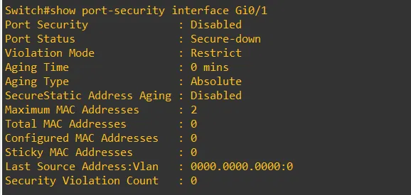

# Switch — Seguridad Básica (SW-02)

[⬅ Volver al índice principal](../../README.md)

> [!NOTE]
> Conforme a la regla del material, se documentan **únicamente** los mecanismos de seguridad que realmente aparecen configurados en el running-config entregado. No se agregan mecanismos adicionales (DHCP snooping, STP avanzado más allá de lo mostrado, shutdown de puertos no usados, etc.) que no estén presentes en el material.

## Mecanismos de seguridad configurados

### 1. Cifrado de contraseñas y credenciales

```
service password-encryption
enable secret 123
```

- `service password-encryption`: cifra (tipo 7) las contraseñas en texto plano almacenadas en la configuración.
- `enable secret 123`: la contraseña de modo privilegiado se almacena con hash irreversible (tipo 5), no en texto plano.

**Evidencia:**


*EVID-SW-001: fragmento del running-config mostrando `enable secret 5 $1$sQb7$DrBqLMS8Jukhoo7i9UOh.1` (hash tipo 5, no reversible) y `no aaa new-model`.*

### 2. Acceso administrativo remoto restringido a SSH

```
line vty 0 4
 login local
 transport input ssh
end
```

- `transport input ssh`: deshabilita Telnet en las líneas VTY, permitiendo únicamente SSH.
- `login local`: exige autenticación contra la base de usuarios local del switch (no acceso sin autenticación).

### 3. Banner de aviso legal

```
banner motd # Acceso autorizado solamente a 2025-0697#
```

Mensaje del día que advierte que el acceso está autorizado únicamente para el propósito documentado (identificador de laboratorio `2025-0697`), disuadiendo accesos no autorizados y dejando constancia de la política de acceso.

### 4. Endurecimiento de protocolos de descubrimiento y árbol de expansión

```
no cdp run
spanning-tree portfast bpduguard default
```

- `no cdp run`: deshabilita CDP (Cisco Discovery Protocol) globalmente, evitando que el switch anuncie información del dispositivo (modelo, IOS, IPs) a vecinos de capa 2, información que podría ser aprovechada por un atacante para reconocimiento.
- `spanning-tree portfast bpduguard default`: habilita BPDU Guard en todos los puertos configurados como PortFast; si un puerto de acceso recibe una BPDU (señal de que se conectó un switch no autorizado), el puerto se pone en estado `err-disable`, evitando ataques de manipulación de Spanning Tree desde puertos de acceso.

### 5. Port-Security en interfaces de acceso

```
interface GigabitEthernet0/1
 switchport mode access
 switchport access vlan 10
 switchport port-security
 switchport port-security maximum 2
 switchport port-security violation restrict
 switchport port-security mac-address sticky
exit

interface GigabitEthernet0/2
 switchport mode access
 switchport access vlan 1
 switchport port-security
 switchport port-security maximum 2
 switchport port-security violation restrict
exit

interface GigabitEthernet0/3
 switchport mode access
 switchport access vlan 1
 switchport port-security
 switchport port-security maximum 2
 switchport port-security violation restrict
exit
```

- **Máximo de direcciones MAC por puerto**: 2 (limita la cantidad de dispositivos que pueden conectarse simultáneamente detrás de un mismo puerto de acceso, mitigando ataques de MAC flooding o la conexión no autorizada de switches/hubs adicionales).
- **Modo de violación**: `restrict` (el tráfico de MAC no autorizadas se descarta y se genera un registro/contador de violación, sin apagar el puerto).
- **`Gi0/1`** (hacia `windows10-1`, VLAN 10) usa además **`mac-address sticky`**, que aprende dinámicamente la(s) primera(s) MAC(s) vista(s) en el puerto y las fija como MAC segura permitida.

### Evidencia de verificación (`show port-security interface Gi0/1`)



*EVID-SW-004: salida del comando `show port-security interface Gi0/1` en el switch: `Violation Mode: Restrict`, `Aging Type: Absolute`, `Maximum MAC Addresses: 2`, `Total MAC Addresses: 0`, `Configured MAC Addresses: 0`, `Sticky MAC Addresses: 0`, `Security Violation Count: 0`.*

> [!NOTE]
> La misma salida reporta `Port Security : Disabled` y `Port Status : Secure-down` en el momento de la captura, a pesar de que la configuración del running-config incluye `switchport port-security` en `Gi0/1`. El material disponible no incluye evidencia adicional (por ejemplo, un `show running-config interface Gi0/1` posterior o una segunda verificación) que permita determinar la causa exacta de este estado en el instante de la captura. Se documenta tal como fue entregado, sin inventar una explicación: **posible verificación pendiente**.

## Referencias cruzadas

- Requisito: **SW-02**.
- Configuración completa: [`../../configs/switch/running-config-switch.txt`](../../configs/switch/running-config-switch.txt).
