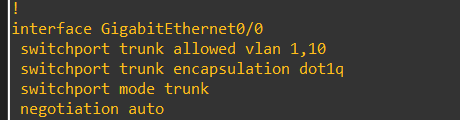
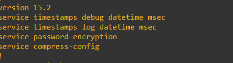
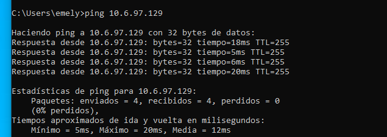

# Switch — VLAN (SW-01)

[⬅ Volver al índice principal](../../README.md)

## Configuración

Extracto del running-config del switch (`configs/switch/running-config-switch.txt`):

```
vlan 10
 name Usuarios
exit
```

```
interface GigabitEthernet0/0
 switchport trunk encapsulation dot1q
 switchport mode trunk
 switchport trunk native vlan 1
 switchport trunk allowed vlan 1,10
exit

interface GigabitEthernet0/1
 switchport mode access
 switchport access vlan 10
 switchport port-security
 switchport port-security maximum 2
 switchport port-security violation restrict
 switchport port-security mac-address sticky
exit
```

## VLAN 10 — Usuarios

| Campo | Valor |
|---|---|
| VLAN ID | 10 |
| Nombre | `Usuarios` |
| Propósito | Segmentar el tráfico de los equipos cliente de la red de Usuarios a nivel de capa 2 |
| Red asociada | 10.6.97.128/25 |
| Gateway | 10.6.97.129 (interfaz `port2.10` del FortiGate) |
| Interfaces del switch involucradas | `Gi0/1` (access, VLAN 10, hacia `windows10-1`), `Gi0/0` (trunk, permite VLAN 1 y 10, hacia el FortiGate `port2`) |

### Función de VLAN 10 para los usuarios

VLAN 10 aísla el dominio de difusión (broadcast domain) de los equipos de Usuarios del resto de la red del switch (VLAN 1 nativa). El enlace hacia el FortiGate (`Gi0/0`) se configura como **trunk 802.1Q**, etiquetando el tráfico de VLAN 10 para que el FortiGate lo reciba en su subinterfaz `port2.10` y pueda aplicarle enrutamiento, DHCP y las políticas de firewall correspondientes a `RED-Usuarios`.

### Evidencia de configuración



*EVID-SW-002: fragmento del running-config mostrando `interface GigabitEthernet0/0` configurada como `switchport mode trunk`, `switchport trunk encapsulation dot1q`, `switchport trunk allowed vlan 1,10`, con `negotiation auto`.*



*EVID-SW-003: encabezado del running-config, `version 15.2`, con `service timestamps debug/log datetime msec`, `service password-encryption` y `service compress-config` habilitados.*

### Evidencia de funcionamiento

La VLAN 10 se demuestra funcional de extremo a extremo mediante:

1. El cliente `windows10-1` obtiene una IP dentro de `10.6.97.128/25` por DHCP (ver [`../06-usuarios/dhcp.md`](../06-usuarios/dhcp.md), [`EVID-USR-001`](../../evidence/05-usuarios/EVID-USR-001.png)).
2. El cliente alcanza el gateway `10.6.97.129` (interfaz `port2.10` del FortiGate) exitosamente:



*EVID-USR-002: `ping 10.6.97.129` responde correctamente (4/4 paquetes, 0% pérdida) desde `windows10-1`, confirmando que el tráfico etiquetado de VLAN 10 llega correctamente desde el switch hasta la subinterfaz `port2.10` del FortiGate a través del enlace trunk `Gi0/0`.*

3. La interfaz `port2.10` del FortiGate está correctamente configurada con la IP `10.6.97.129/255.255.255.128` y el `vlanid 10` sobre la interfaz padre `port2` (ver [`../02-topologia/direccionamiento.md`](../02-topologia/direccionamiento.md) y [`EVID-FGT-006`](../../evidence/02-fortigate/EVID-FGT-006.png)).

## Referencias cruzadas

- Requisito: **SW-01**.
- Relacionado: [`../06-usuarios/vlan10.md`](../06-usuarios/vlan10.md), [`../06-usuarios/dhcp.md`](../06-usuarios/dhcp.md).
- Configuración completa: [`../../configs/switch/running-config-switch.txt`](../../configs/switch/running-config-switch.txt).
