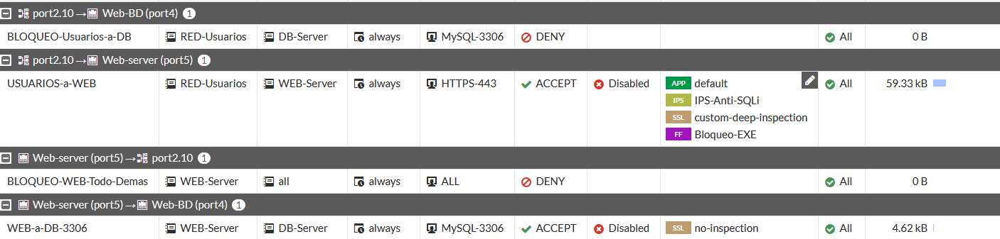
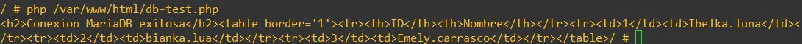

# Comunicación WEB-Server → DB-Server (FGT-12, FGT-13)

[⬅ Volver al índice principal](../../README.md)

Este requisito tiene una sección independiente, tal como exige el prompt maestro, por tratarse de una de las restricciones de seguridad más importantes del laboratorio.

> [!NOTE]
> **WEB-Server solo puede comunicarse con DB-Server utilizando TCP/3306.**
> **No debe poder utilizar otros puertos/servicios hacia DB-Server.**

## Política permitida

La política de firewall `WEB-a-DB-3306` (documentada también en [`../03-fortigate/configuracion.md`](../03-fortigate/configuracion.md)):

| Campo | Valor |
|---|---|
| Interfaz de entrada | `Web-server (port5)` |
| Interfaz de salida | `Web-BD (port4)` |
| Origen | `WEB-Server` (10.6.97.2/32) |
| Destino | `DB-Server` (10.6.97.18/32) |
| Servicio | `MySQL-3306` |
| Acción | **ACCEPT** |
| NAT | Disabled |
| Perfil SSL | `no-inspection` |
| Bytes registrados | 4.62 kB |

*EVID-FGT-011: la política `WEB-a-DB-3306` permite únicamente el servicio `MySQL-3306` desde `WEB-Server` hacia `DB-Server`.*

## Restricción de servicios / política de denegación

No existe, en el material entregado, una política explícita de "DENY" adicional para otros puertos desde WEB-Server hacia DB-Server: la restricción se logra porque **la única política que permite tráfico desde `WEB-Server` hacia `DB-Server` está limitada al servicio `MySQL-3306`**, y FortiGate aplica una **denegación implícita** a cualquier tráfico que no coincida con ninguna política explícita de `ACCEPT`. Cualquier otro puerto/servicio desde WEB-Server hacia DB-Server, por tanto, cae en la denegación implícita del firewall.

Adicionalmente, la política `BLOQUEO-WEB-Todo-Demas` (WEB-Server → `port2.10`/`all`, servicio `ALL`, acción **DENY**) refuerza que el WEB-Server no tiene autorización general de salida hacia otros destinos salvo lo explícitamente permitido.

## Pruebas

| Prueba | Origen | Destino | Puerto | Resultado esperado | Resultado observado | Evidencia |
|---|---|---|---|---|---|---|
| Conectividad WEB→DB por el puerto de servicio | web-server-lab-1 | db-server-lab-1 (10.6.97.18) | TCP/3306 | Abierto (permitido) | **Abierto** — banner MariaDB recibido | [`EVID-DB-003`](../../evidence/04-servidores/EVID-DB-003.png) |
| Conectividad WEB→DB por HTTP | web-server-lab-1 | db-server-lab-1 (10.6.97.18) | TCP/80 | Cerrado (no permitido) | **Timed out** | [`EVID-DB-004`](../../evidence/04-servidores/EVID-DB-004.png) |
| Conectividad WEB→DB por SSH | web-server-lab-1 | db-server-lab-1 (10.6.97.18) | TCP/22 | Cerrado (no permitido) | **Timed out** | [`EVID-DB-004`](../../evidence/04-servidores/EVID-DB-004.png) |
| Conectividad WEB→DB por HTTPS | web-server-lab-1 | db-server-lab-1 (10.6.97.18) | TCP/443 | Cerrado (no permitido) | **Timed out** | [`EVID-DB-004`](../../evidence/04-servidores/EVID-DB-004.png) |
| Conexión aplicativa (capa de aplicación PHP → MariaDB) | web-server-lab-1 | db-server-lab-1 | 3306 (mysqli) | Conexión exitosa | **Conexión MariaDB exitosa**, consulta de 3 registros retornada | [`EVID-WEB-002`](../../evidence/04-servidores/EVID-WEB-002.webp) |

### Evidencia consolidada

*EVID-DB-003: banner de protocolo de MariaDB recibido desde `web-server-lab-1` al conectar a `10.6.97.18:3306`, evidencia directa de que el único puerto permitido está efectivamente accesible.*

*EVID-DB-004: los tres intentos consecutivos (`80`, `22`, `443`) resultan en `nc: timed out`, confirmando que **ningún otro servicio del DB-Server es alcanzable desde el WEB-Server**, cumpliendo estrictamente el requisito FGT-13.*

*EVID-WEB-002: a nivel de aplicación, el script PHP en `web-server-lab-1` logra conectarse y consultar `labdb.users` a través del puerto 3306, confirmando que el flujo de datos real de la aplicación (no solo el puerto TCP) funciona correctamente bajo esta restricción.*

## Conclusión

Los requisitos **FGT-12** (WEB-Server únicamente se comunica con DB-Server mediante TCP/3306) y **FGT-13** (WEB-Server no tiene comunicación con otros servicios del DB-Server) quedan demostrados de forma consistente: una política explícita permite solo 3306, la denegación implícita (reforzada por `BLOQUEO-WEB-Todo-Demas`) cubre el resto, y las pruebas activas confirman ambos extremos (3306 abierto, 80/22/443 cerrados).

## Referencias cruzadas

- Requisitos: **FGT-12, FGT-13, SRV-02, SRV-04**.
- [`web-server.md`](web-server.md), [`db-server.md`](db-server.md).
- [`../03-fortigate/politica-usuarios-db.md`](../03-fortigate/politica-usuarios-db.md).
