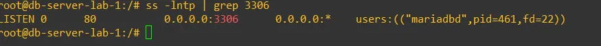
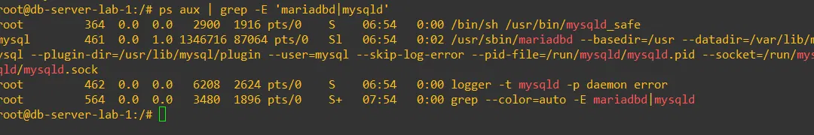
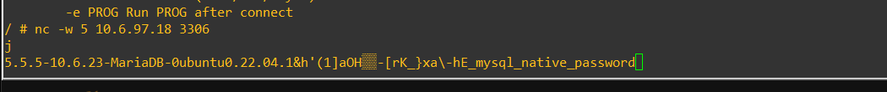
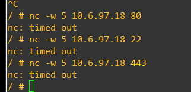

# DB-Server (SRV-03, SRV-04)

[⬅ Volver al índice principal](../../README.md)

## Identificación

| Campo | Valor | Evidencia |
|---|---|---|
| Nombre GNS3 | `db-server-lab-1` | [`EVID-TOPO-003`](../../evidence/01-topologia/EVID-TOPO-003.png) |
| IP | 10.6.97.18/28 | [`EVID-FGT-009`](../../evidence/02-fortigate/EVID-FGT-009.png) (objeto de dirección FortiGate) |
| Red | 10.6.97.16/28 | [`EVID-TOPO-001`](../../evidence/01-topologia/EVID-TOPO-001.png) |
| Gateway | 10.6.97.17 (interfaz `Web-BD`/port4 del FortiGate) | [`EVID-FGT-005`](../../evidence/02-fortigate/EVID-FGT-005.png) |
| Sistema base | Ubuntu 22.04 (contenedor Docker) + MariaDB | [`configs/db-server/db-server-dockerfile-y-start-script.txt`](../../configs/db-server/db-server-dockerfile-y-start-script.txt) |

> [!NOTE]
> No se proporcionó una captura de `ip addr` ejecutada directamente dentro de `db-server-lab-1` (equivalente a `EVID-WEB-001` del servidor web). La IP `10.6.97.18` se confirma por el objeto de dirección del FortiGate, por el direccionamiento de diseño y, funcionalmente, por el banner de MariaDB obtenido al conectar contra `10.6.97.18:3306` (ver [`EVID-DB-003`](../../evidence/04-servidores/EVID-DB-003.png) más abajo). **Evidencia pendiente de incorporar** si se requiere la captura directa.

## Servicio de base de datos (SRV-03)

Motor **MariaDB**, desplegado en un contenedor Docker (`configs/db-server/db-server-dockerfile-y-start-script.txt`):

```dockerfile
FROM ubuntu:22.04
RUN apt update && apt install -y mariadb-server iproute2 net-tools iputils-ping && apt clean

RUN mkdir -p /run/mysqld && chown mysql:mysql /run/mysqld && \
    service mariadb start && \
    mysql -e "CREATE DATABASE labdb; \
    CREATE TABLE labdb.users (id INT PRIMARY KEY, name VARCHAR(50)); \
    INSERT INTO labdb.users VALUES (1,'alice'),(2,'bob'); \
    CREATE USER 'webuser'@'%' IDENTIFIED BY 'Lab#2026'; \
    GRANT SELECT ON labdb.* TO 'webuser'@'%'; \
    FLUSH PRIVILEGES;" && \
    sed -i "s/^bind-address.*/bind-address = 0.0.0.0/" /etc/mysql/mariadb.conf.d/50-server.cnf
```

- **Base de datos**: `labdb`, tabla `users` (columnas `id`, `name`).
- **Usuario de aplicación**: `webuser`, con permiso `SELECT` únicamente sobre `labdb.*` (privilegio mínimo necesario para la aplicación).
- **`bind-address = 0.0.0.0`**: necesario para que MariaDB acepte conexiones remotas (del WEB-Server), no solo `localhost`.

El script de arranque de red (`start-network.sh`, incluido en el mismo archivo de configuración) asigna la IP de forma dinámica vía variables de entorno (`IP_ADDR=10.6.97.18`, `PREFIX=28`, `GATEWAY=10.6.97.17` por defecto) y arranca el servicio `mariadb`.

### Evidencia del servicio activo



*EVID-DB-001: `ss -lntp | grep 3306` en `db-server-lab-1` muestra `LISTEN 0 80 0.0.0.0:3306 0.0.0.0:* users:(("mariadbd",pid=461,fd=22))`, confirmando que MariaDB escucha en todas las interfaces por el puerto 3306.*



*EVID-DB-002: `ps aux | grep -E 'mariadbd|mysql'` confirma el proceso `/usr/sbin/mariadbd` en ejecución (usuario `mysql`, PID 461), junto con `mysqld_safe` (PID 364) y el proceso `logger` asociado.*

## Puerto involucrado en la política (SRV-04)

**TCP/3306**, el puerto estándar de MySQL/MariaDB, es el único servicio autorizado hacia `DB-Server` en las políticas del FortiGate (`WEB-a-DB-3306` permite; `BLOQUEO-Usuarios-a-DB` deniega). Ver detalle completo en [`comunicaciones.md`](comunicaciones.md) y [`../03-fortigate/politica-usuarios-db.md`](../03-fortigate/politica-usuarios-db.md).

### Evidencia de que el puerto 3306 está efectivamente accesible (desde WEB-Server)



*EVID-DB-003: `nc -w 5 10.6.97.18 3306` ejecutado desde `web-server-lab-1` recibe el banner de protocolo de MariaDB (`5.5.5-10.6.23-MariaDB-...mysql_native_password`), confirmando que el puerto 3306 está abierto y accesible desde el WEB-Server.*

## Restricciones (otros servicios NO accesibles desde WEB-Server)



*EVID-DB-004: intentos de `nc -w 5 10.6.97.18 80`, `nc -w 5 10.6.97.18 22` y `nc -w 5 10.6.97.18 443`, todos ejecutados desde `web-server-lab-1`, resultan en `nc: timed out`, confirmando que ningún otro puerto/servicio del DB-Server es alcanzable desde el WEB-Server (ver detalle completo del requisito en [`comunicaciones.md`](comunicaciones.md)).*

## Referencias cruzadas

- Requisitos: **SRV-03, SRV-04**.
- Configuración completa: [`../../configs/db-server/db-server-dockerfile-y-start-script.txt`](../../configs/db-server/db-server-dockerfile-y-start-script.txt).
- Restricción de origen (Usuarios bloqueados): [`../03-fortigate/politica-usuarios-db.md`](../03-fortigate/politica-usuarios-db.md).
- Comunicación permitida (WEB-Server): [`comunicaciones.md`](comunicaciones.md).
