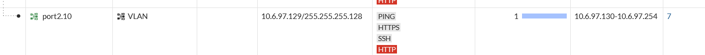
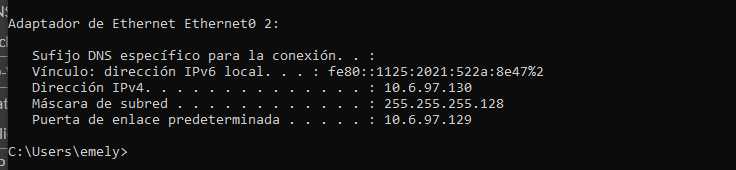
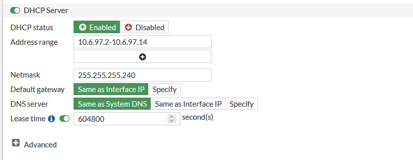

# Usuarios — DHCP (USR-03)

[⬅ Volver al índice principal](../../README.md)

## Red servida

10.6.97.128/25 (VLAN 10 — Usuarios), a través del servidor DHCP configurado en la interfaz `port2.10` del FortiGate.

## Rango DHCP verificado (VLAN 10 / port2.10)

| Campo | Valor |
|---|---|
| Interfaz | `port2.10` |
| Red/VLAN | VLAN 10, 10.6.97.128/25 |
| Gateway | 10.6.97.129 |
| Rango DHCP | 10.6.97.130 – 10.6.97.254 |
| DNS | No proporcionado en el material disponible |

*EVID-FGT-006: la fila de la interfaz `port2.10` en la tabla de interfaces del FortiGate muestra el rango `10.6.97.130-10.6.97.254` en la columna correspondiente al servidor DHCP de esa interfaz.*

## Evidencia de asignación / prueba desde un cliente

*EVID-USR-001: `ipconfig` en `windows10-1` muestra `Dirección IPv4: 10.6.97.130`, `Máscara de subred: 255.255.255.128`, `Puerta de enlace predeterminada: 10.6.97.129` — la primera dirección del rango configurado (`10.6.97.130`), consistente con una asignación DHCP exitosa.*

## Otra pantalla de configuración DHCP incluida en el material

*EVID-FGT-007: pantalla "DHCP Server" del FortiGate con `DHCP status: Enabled`, `Address range: 10.6.97.2-10.6.97.14`, `Netmask: 255.255.255.240` (/28), `Default gateway: Same as Interface IP`, `Lease time: 604800` segundos (7 días).*

> [!NOTE]
> Esta segunda pantalla de configuración DHCP (EVID-FGT-007) corresponde a un rango distinto (`10.6.97.2–10.6.97.14/28`) del documentado para VLAN 10/Usuarios (`10.6.97.130–10.6.97.254/25`, EVID-FGT-006). La tabla de interfaces físicas (EVID-FGT-003) asocia este rango a la interfaz física `port2` (que se muestra con IP `0.0.0.0/0.0.0.0`, es decir, sin dirección propia asignada en el momento de esa captura). El material disponible **no incluye información adicional** que permita confirmar con certeza el propósito actual de este segundo alcance DHCP (por ejemplo, si corresponde a una configuración anterior/de prueba sobre `port2` antes de crearse la subinterfaz `port2.10`, o a otro propósito). Se documenta tal como fue entregado, sin inventar una explicación adicional, conforme a la regla de no inventar información. El rango efectivamente verificado end-to-end con un cliente real es el de `port2.10` (10.6.97.130–254), documentado arriba.

## Prueba desde un cliente

Ver evidencia completa de `ipconfig` (EVID-USR-001) arriba, y la prueba de conectividad posterior al gateway asignado ([`../03-fortigate/ruta-default.md`](../03-fortigate/ruta-default.md), [`EVID-USR-002`](../../evidence/05-usuarios/EVID-USR-002.png)).

## Referencias cruzadas

- Requisito: **USR-03**.
- [`vlan10.md`](vlan10.md).
