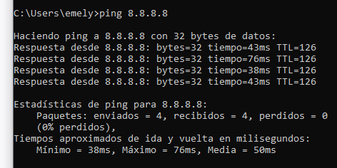
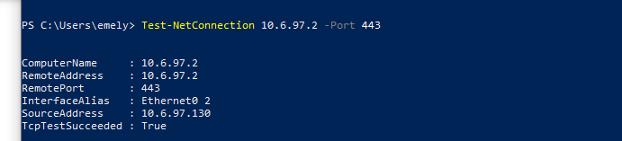
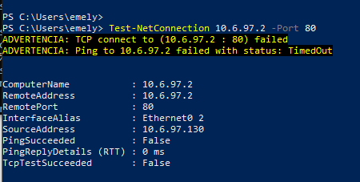
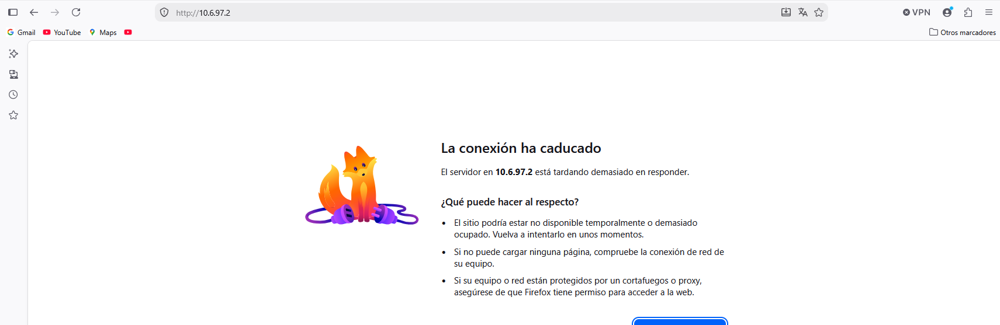

# Pruebas de Conectividad

[⬅ Volver al índice principal](../../README.md)

## Prueba 1 — Cliente de Usuarios → Gateway VLAN 10

### Objetivo
Verificar que el cliente de la red de Usuarios tiene conectividad de capa 3 con su gateway (`port2.10` del FortiGate).

### Condiciones iniciales
Cliente `windows10-1` con IP asignada por DHCP (`10.6.97.130/25`), conectado al puerto de acceso VLAN 10 del switch.

### Procedimiento
```
ping 10.6.97.129
```

### Resultado esperado
Respuesta exitosa (0% de pérdida).

### Resultado observado
4 paquetes enviados, 4 recibidos, 0% perdidos. Tiempos: mínimo 5 ms, máximo 20 ms, media 12 ms.

### Evidencia


### Conclusión de la prueba
**Éxito.** Confirma conectividad de capa 3 entre el cliente y el gateway del FortiGate, condición previa necesaria para cualquier política de firewall posterior.

---

## Prueba 2 — Cliente de Usuarios → Internet

### Objetivo
Verificar que la ruta por defecto y el NAT configurados permiten la salida a Internet desde la red de Usuarios.

### Condiciones iniciales
Cliente `windows10-1` con conectividad previa al gateway confirmada (Prueba 1).

### Procedimiento
```
ping 8.8.8.8
```

### Resultado esperado
Respuesta exitosa.

### Resultado observado
4 paquetes enviados, 4 recibidos, 0% perdidos. Tiempos: mínimo 38 ms, máximo 76 ms, media 50 ms.

### Evidencia


### Conclusión de la prueba
**Éxito.** Confirma que la ruta por defecto (`0.0.0.0/0` vía `192.168.42.1`, `port1`) y el NAT de la política `Usuarios-a-Internet` funcionan correctamente de extremo a extremo.

---

## Prueba 3 — Cliente de Usuarios → WEB-Server (HTTPS/443)

### Objetivo
Verificar que la política `USUARIOS-a-WEB` permite tráfico HTTPS hacia el WEB-Server.

### Condiciones iniciales
Cliente en la red de Usuarios; WEB-Server activo en `10.6.97.2`.

### Procedimiento
```powershell
Test-NetConnection 10.6.97.2 -Port 443
```

### Resultado esperado
`TcpTestSucceeded: True`.

### Resultado observado
`TcpTestSucceeded : True` (ver también `SourceAddress: 10.6.97.130`).

### Evidencia


### Conclusión de la prueba
**Éxito.** Confirma el requisito FGT-03 (Política 1).

---

## Prueba 4 — Cliente de Usuarios → WEB-Server (HTTP/80, no autorizado)

### Objetivo
Verificar que **solo** HTTPS/443 está autorizado hacia WEB-Server, no HTTP/80.

### Condiciones iniciales
Igual que la Prueba 3.

### Procedimiento
```powershell
Test-NetConnection 10.6.97.2 -Port 80
```
Adicionalmente, se intentó `http://10.6.97.2` directamente desde el navegador.

### Resultado esperado
Fallo de conexión (timeout).

### Resultado observado
`TcpTestSucceeded : False`, `PingSucceeded : False`, con estado `TimedOut`. El navegador reporta *"La conexión ha caducado"*.

### Evidencia



### Conclusión de la prueba
**Éxito (comportamiento esperado).** Refuerza que la política restringe el servicio exactamente a `HTTPS-443`.

---

## Prueba 5 — Cliente de Usuarios → DB-Server (TCP/3306, bloqueado)

Ver detalle completo en [`pruebas-politicas.md`](pruebas-politicas.md) (Prueba de bloqueo de Política 2).

---

## Prueba 6 — WEB-Server → DB-Server (TCP/3306, permitido) y otros puertos (bloqueados)

Ver detalle completo en [`../05-servidores/comunicaciones.md`](../05-servidores/comunicaciones.md).
