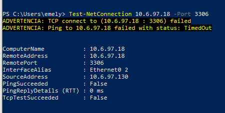

# Pruebas de Políticas de Firewall

[⬅ Volver al índice principal](../../README.md)

## Prueba — Bloqueo de Política 2 (Usuarios → DB-Server, TCP/3306)

### Objetivo
Verificar que la política `BLOQUEO-Usuarios-a-DB` impide efectivamente que un cliente de la red de Usuarios acceda al DB-Server por su puerto de servicio.

### Condiciones iniciales
Cliente `windows10-1` (10.6.97.130) en la red de Usuarios; DB-Server activo en `10.6.97.18:3306`; política `BLOQUEO-Usuarios-a-DB` configurada con acción `DENY` (ver [`../03-fortigate/politica-usuarios-db.md`](../03-fortigate/politica-usuarios-db.md)).

### Procedimiento
```powershell
Test-NetConnection 10.6.97.18 -Port 3306
```

### Resultado esperado
`TcpTestSucceeded: False` (conexión bloqueada).

### Resultado observado
```
ADVERTENCIA: TCP connect to (10.6.97.18 : 3306) failed
ADVERTENCIA: Ping to 10.6.97.18 failed with status: TimedOut
...
TcpTestSucceeded : False
```

### Evidencia


### Conclusión de la prueba
**Éxito.** El bloqueo de la Política 2 (FGT-04) se cumple: los usuarios no pueden acceder directamente al DB-Server por TCP/3306.

---

## Prueba — Permiso de Política 1 (Usuarios → WEB-Server, HTTPS/443)

Ver [`pruebas-conectividad.md`](pruebas-conectividad.md) (Prueba 3) para el detalle completo con evidencia `EVID-TEST-001`.

## Prueba — Restricción WEB-Server → DB-Server a solo TCP/3306

Ver [`../05-servidores/comunicaciones.md`](../05-servidores/comunicaciones.md) para el detalle completo con evidencia `EVID-DB-003` (3306 abierto) y `EVID-DB-004` (80/22/443 cerrados).

## Resumen comparativo

| Prueba | Origen | Destino | Puerto | Resultado esperado | Resultado observado | Evidencia |
|---|---|---|---|---|---|---|
| Política 1 (Usuarios→WEB) | 10.6.97.130 | 10.6.97.2 | 443 | Permitido | **Permitido** | [`EVID-TEST-001`](../../evidence/06-pruebas/EVID-TEST-001.png) |
| Política 1, puerto no autorizado | 10.6.97.130 | 10.6.97.2 | 80 | Bloqueado | **Bloqueado** | [`EVID-TEST-002`](../../evidence/06-pruebas/EVID-TEST-002.png) |
| Política 2 (Usuarios→DB) | 10.6.97.130 | 10.6.97.18 | 3306 | Bloqueado | **Bloqueado** | [`EVID-TEST-003`](../../evidence/06-pruebas/EVID-TEST-003.png) |
| WEB→DB (permitido) | 10.6.97.2 | 10.6.97.18 | 3306 | Permitido | **Permitido** | [`EVID-DB-003`](../../evidence/04-servidores/EVID-DB-003.png) |
| WEB→DB (otros puertos) | 10.6.97.2 | 10.6.97.18 | 80/22/443 | Bloqueado | **Bloqueado** | [`EVID-DB-004`](../../evidence/04-servidores/EVID-DB-004.png) |
